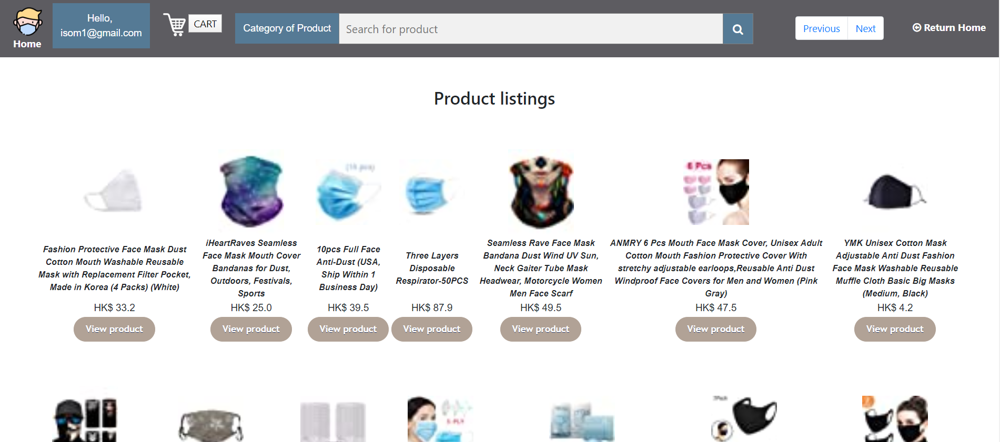
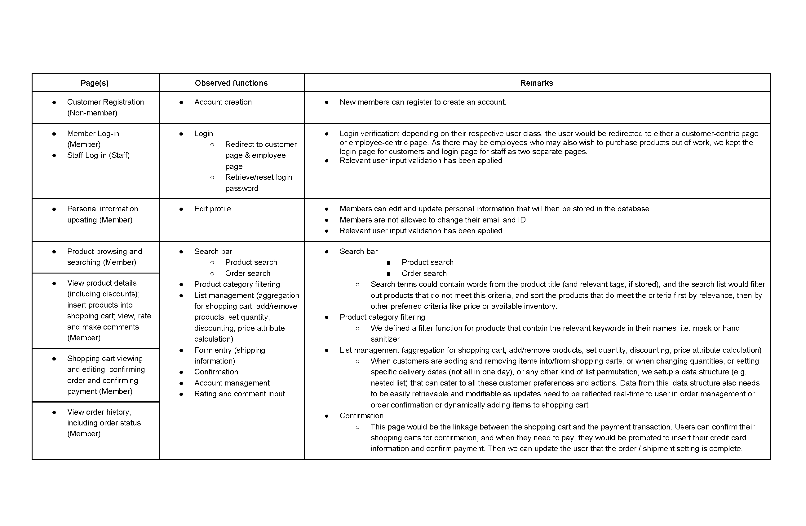
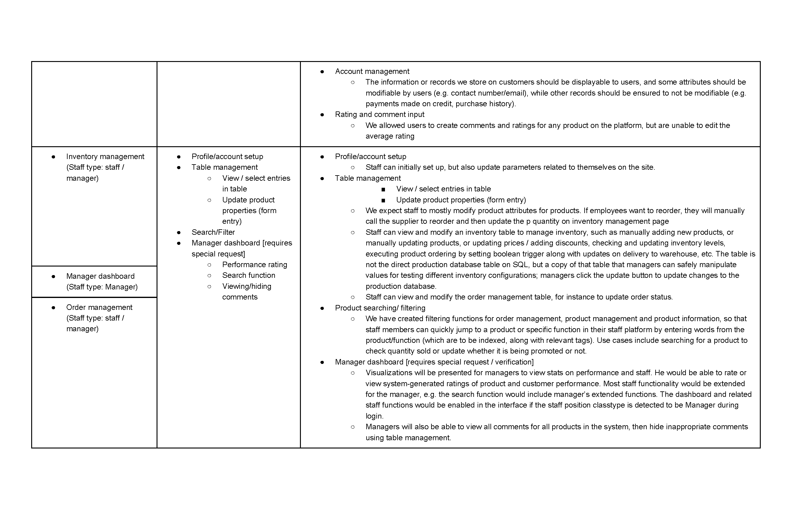

## SuperClean Ecommerce Platform

[[video]](https://www.youtube.com/watch?v=TQfygqFXgVA) A fullstack ecommerce web application with JavaScript frontend, interfacing with flask backend and data stored on an Oracle SQL database. 

</img>

### Setup instructions:
1. Change directory into folder with main.py
2. Install dependencies on python3 with
```
pip install -r requirements.txt
```
3. Wipe and initialize database (**WARNING: RUNNING database.py WILL WIPE THE EXISTING STORED DATABASE**)
```
python database.py
```

Ensure database keys are set in:
```
HOST_NAME = "/"
PORT_NUMBER = "/"
SERVICE_NAME = "/"
USERNAME = "/"
PASSWORD = "/"
```

### Running the server: 
This is for running the development server.
1. On Anaconda Prompt, run
```
python main.py
```
2. Go to http://127.0.0.1:5000/

### Deployment
This is for running the production server. ngrok is used here for reference, though you may use other services if preferred.
1. Run flask server deployment script
```
python serve.py
```
2. Run ngrok
```
ngrok http 8000
```

### Functional requirements:

</img>
</img>

### Acknowledgements

Code from this repository should not be used for commercial purposes without consent from the author. If you wish to use code from this repository for your own platform or academic purposes, please acknowledge the source code and its origin. Thank you for your understanding.
```
@misc{sdattaECOMM,
  title={superclean-ecommerce},
  author={Datta, Siddhartha},
  year={2020},
  howpublished={\url{https://github.com/dattasiddhartha/fullstack-ecommerce}},
}
```
